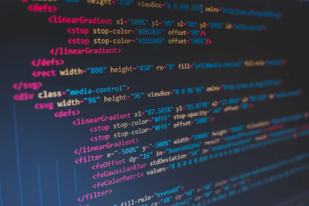

<h1>Introduction</h1>
	
Software engineering has been quite a journey for me as it helped me get a better understanding of what web application development is like. Although, that is just not what describes software engineering as there is more to it that you can gain from. For me personally, I acquired fundamental knowledge in Open Source Software Development, Functional Programming, and Agile Project Management.

<h1>Open Source Software Development</h1>
	From the start of my software engineering journey, we were told to use an Open Source Software Development tool. An Open Source Software Development tool is a tool that is used to store source code that allows the ability for publishers to make their programs available to the public, allows their source codes to be modified, allows the source code to be distributed among others, and allows the ability for collaborative development within a community. An Open Source Software Development tool that I got to gain knowledge from was using GitHub, which is a platform where developers get to share, store, and collaborate with other developers on source codes and/or programs. I have gotten used to it right around the first 3 weeks of my software engineering class because as we were moving along the curriculum, I got to spend some time looking around GitHub and learning how to store and share the source codes and programs that I had made. I did use GitHub even before I started learning software engineering, but I was never good at it until I did take software engineering. I could see myself in the future, and having this skill may be vital to those looking for someone who knows how to use Open Source Software Development tools.

<h1>Functional Programming</h1>
	At the midpoint of my software engineering journey we were exposed to a lesson called Functional Programming, which is a program paradigm that composes and applies functions. To make it sound less computer science jargony, what I’m talking about is using a step by step procedure that would always give you the same answer. For the first time this was taught, I thought it was going to be very difficult because of how complex it is, but as time went by and a few practices later I seemed to get a better understanding of it. This may be very useful in the future as I can use functional programming when there are concurrent code blocks.

<h1>Conclusion</h1>
	As I continue along with my journey to software engineering, I know that I can learn more than what I have now. It may seem little, but in the long run it will be a vital part in my career as a software engineer. Through hard work and determination, I know I can make it through.
