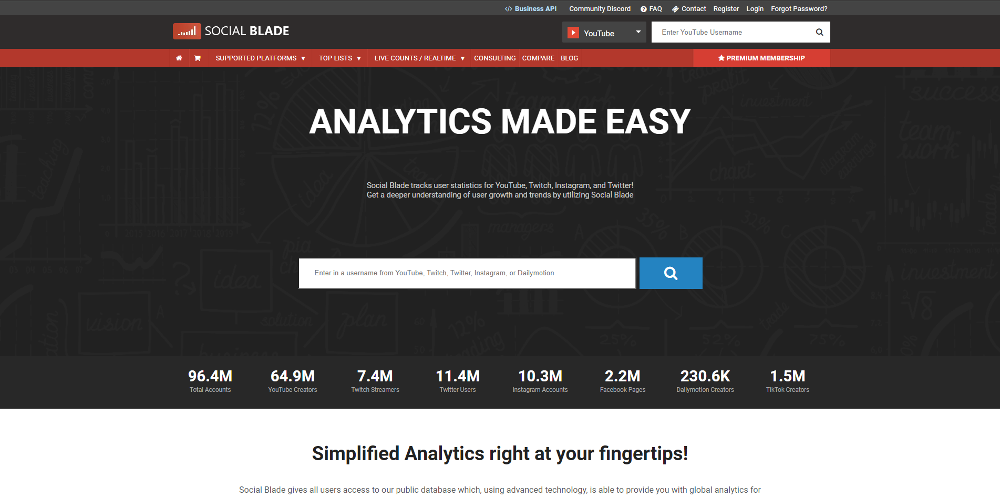

<h2>Introduction</h2>

In order to garner visitors to our websites, we need to make one that is for sure appealing. A clever title and a cleverly written essay won’t do justice to your hard work. Think of it as a piece of art - you’re showing them what you got, your personality attached to your work, and you don’t want to show them an unfinished product now do you? I’m no art major by any means, nor am I good at anything artsy, but being simple is all it takes to garner a lot of people.

<h2>Colors</h2>

Assuming you’ve already typed your nearly finished product (everything but the UI frameworks), why not start with background colors? From a website that I’ve read and have now forgotten the name of, there are a lot of possibilities to choose to color your website. Put some splash of life to your website rather than just the default color - white. Pick a set of colors that work together and apply it to your website and it should look a lot better than it was before. Maybe even pick a background image and be creative.

<h2>Divide</h2>

Don’t just end there yet, divide your website into elements to make it “dynamic” and what I mean by that is separating certain elements into their own containers so that you can apply the set of colors that you wanted to use for your website rather than having all of them in a single container and were only able to implement one of the set of colors you want to put in your website. You don’t want a website where it only has one color now, huh? Make sure to put some margins and padding onto it too so that the colors don’t just appear right after the start or end of the next element’s container.

<h2>Position</h2>

Make sure to position everything properly, maybe make it so that everything is centered, make certain parts be columns from a row, etc. but most importantly, style it the way you want it to. Also make sure to use a bigger or smaller font based on what the sentences you created and used for - make the fonts big if it is a header, make the fonts smaller if it’s just a paragraph and so forth. Make sure to implement colors for your texts so that they contrast to the background color or image on your website. Style how you would want to see your website.

<h2>Final Words…</h2>

I believe that UI frameworks are a big step into making your website more appealing as it helps stylize your nearly finished product to a finished one that you desired. I did have a hard time dealing with UI frameworks as it does get complex along the way, but the end result won’t leave you unsatisfied. It sure did leave me satisfied with my work.

