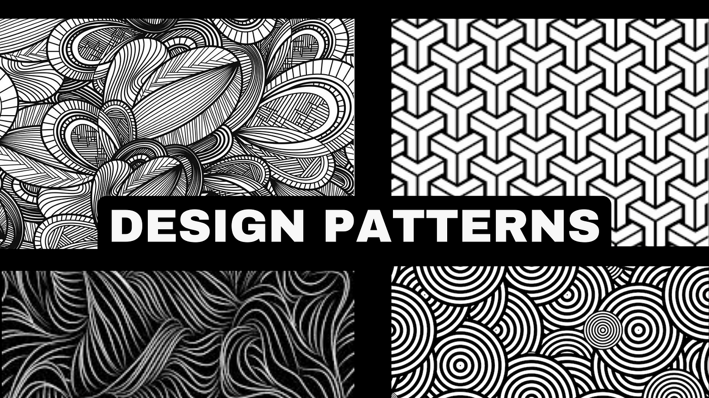

<h2>Introduction</h2>

Whether you are starting a new project or finishing up the one that you are currently working on, a design to your page or pages can definitely boost your website via customer or user activity. You can design as much as you want for each of your separate pages. Better yet, you can reuse your design to certain blocks of codes without having to come up with more unique designs for your website, which might be time consuming if this project is scheduled to be submitted at a set date and time.

<h2>Don’t Dawdle on One Thing and Make More of it</h2>

Assuming you’ve already typed your nearly finished product (everything but the UI frameworks), why not start with background colors? From a website that I’ve read and have now forgotten the name of, there are a lot of possibilities to choose to color your website. Put some splash of life to your website rather than just the default color - white. Pick a set of colors that work together and apply it to your website and it should look a lot better than it was before. Maybe even pick a background image and be creative.

<h2>Divide</h2>

Although working hard on a project for its design is not bad as you either want to show users your creativity, how much you are dedicated to your job, and such but working on design for some time alone can affect your progression with your project as you  have spent a majority of that time working on the design when you could have used that time to fix bugs and resolving some coding issues. Making too much of a design can be too much for a user too, it might be too colorful or too many things on one page, etc. Look at other websites as a means of exposure of what designs they use, most if not all of them do not overdo their design, in fact theirs is very much just a couple few designs.

<h2>Work Smart, Not Hard</h2>

Being simple is not as bad as some people may think. If you could see other websites you see that some of their designs are the same as the others. So, just a couple of designs and repeatedly using them in your page or pages is sufficient enough to garner customer or user activity on your website as it is not too much or too little designs. To make your life a lot easier, make a unique CSS class name that has the design and style that you like for your code so that these blocks of codes can have the same design by just having that unique CSS class name rather than implementing the same code into different blocks over and over again, which can be very repetitive and messy.

<h2>Final Words…</h2>

I too make CSS class names for a certain design and style for my code as I really like some parts of the code to either have a similar and different look to another, wherever they are in the website project I am working on. My last few words is that, you should utilize using CSS, or any language that is used to style your website that you are more comfortable in using, as a way to style and design your website is very important as it prevents the use of repetitive styling codes on your files.

